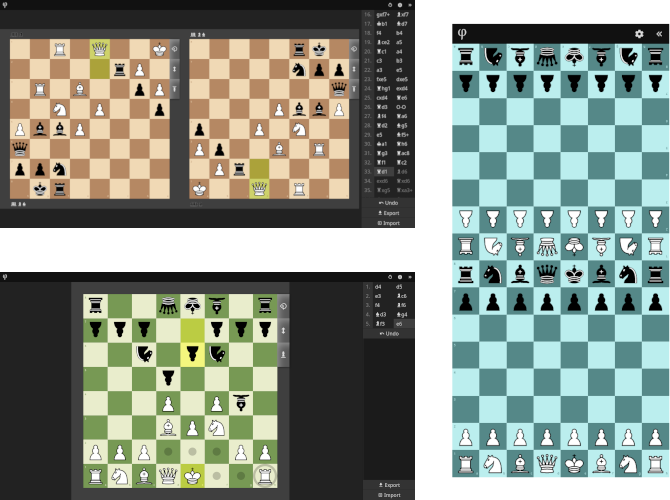

phichess
========

This web app allows two human players to play "over the board" on any device
with a web browser.

It features an adaptive layout with one or two board views:
Play on a mobile screen while sitting opposite each other
or on a monitor while sitting next to each other.

On devices & browsers that support it, the app can be installed as a Progressive Web App (PWA).

To do
-----

* [x] detect checkmate
* [x] detect draw by stalemate
* [x] detect draw by threefold repetition
* [x] detect draw by fifty moves rule
* [x] detect draw by insufficient material
* [ ] interpret timeout against insufficient material as draw
* [ ] detect blocked positions?
* [x] highlight last move
* [x] highlight check
* [x] show legal moves
* [x] piece symbols in algebraic notation
* [x] option for regular notation
* [x] export PGN
* [x] export FEN
* [ ] import PGN (import FEN?)
* [x] progressive web app (PWA)
